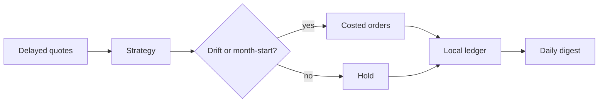

# Bleusz

Python · TypeScript · C++ · C#

Public work is a **paper-trading systems lab**: delayed market data, a local ledger, drift/calendar rebalancing, weekday CI. Production systems stay private. No live broker. Not investment advice.

## Public repository

**[paper-invest](https://github.com/Bleuszz/paper-invest)** — Python 3.11 paper engine.

| Layer | Implementation |
|---|---|
| Strategy | `core_satellite_v1` — long-only liquid ETFs |
| Book | £100,000 virtual (≈ $127,000 US-listed) |
| Core 80% | `VOO` 50 · `VXUS` 20 · `BND` 10 |
| Satellite 15% | `QQQ` 10 · `GLD` 5 |
| Cash | 5% floor, 95% max invested |
| Costs | 5 bps commission + 5 bps slippage each way |
| Triggers | ≥20% relative drift, or first trading day of month |
| Venue | `LocalLedger` only |
| Schedule | Weekdays 21:20 Europe/London · GitHub Actions |
| Data | yfinance → Yahoo chart → Stooq |

## Stack

`Python 3.11` `pandas` `yfinance` `pytest` `GitHub Actions`

Also ships work in TypeScript, C++ and C# — those trees are not on the public account.

## Boundary

- Public repos contain no API keys, no PII, no live order path.
- `PAPER_ONLY = True` is hardcoded. There is no live upgrade in the published code.
- Everything else stays private. If it is not linked above, it is not public.
